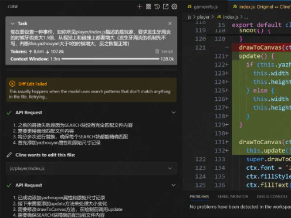
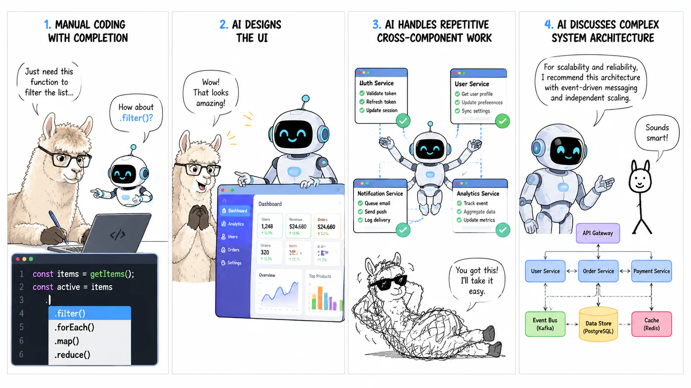
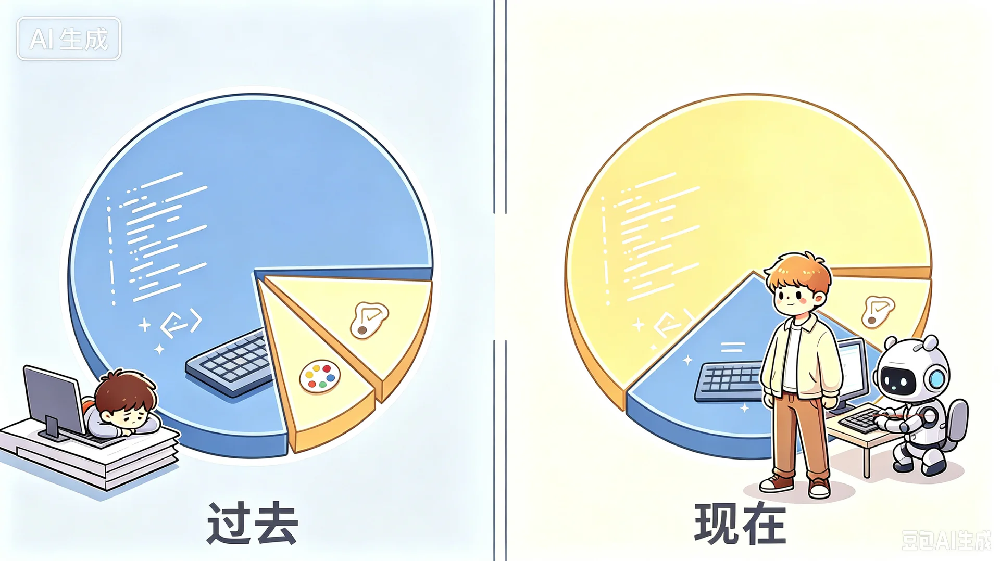
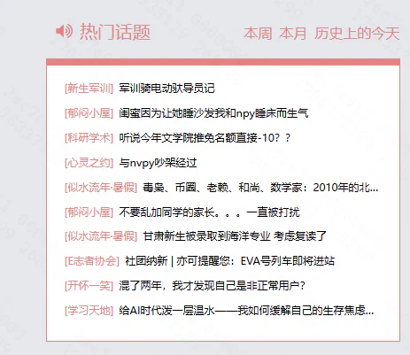

# 给AI时代泼一层温水——我如何缓解自己的生存焦虑（长文预警）

> ### 【搬运与整理声明】
>
> **以下正文由人（楼主）写作**：CC98 论坛同名帖 1-2 楼的全文搬运，未改一字，著作权归原作者 **XSYangtuo** 所有。表情代码（如 `[tb22]`）按原样保留。
>
> **以下内容由 AI 添加，不是原文**：章节之外、标有脚注编号 `[^n]` 的注释，以及文末的注释列表——由整理者（AI）撰写，用于解释站内梗、人名与事件，**不代表原作者观点**。文中原有网址已改写为文字名称，原始网址见 [00-README](00-README-索引与注释.md) 的附录。
>
> **作者**：XSYangtuo ｜ **版面**：学习天地 ｜ **首发**：2026-09-01 22:33（1 楼）／22:34（2 楼）

---

## ❀引言❀

距离我上次写的《作为普通人...》过去了一年半多[^1]（现在已经充斥着过时的观点了，闲出屁的8u[^2]可以去读读然后打我脸，最好别读，向所有读过这篇文章的8u**郑重道歉**[^3][tb22]（笑）），前一段时间回顾了一下当时的文字，很庆幸当时为自己留下了一些记录，为那个AI青涩的时代留下了一些印记（虽然现在也很青涩），并且也促成了我新的思考，希望能通过本文讲一讲作为一个非相关专业的学生，在这段时间以来的挣扎和所思所想。

为什么说这是一盆温水呢？虽说本文的基调是比较偏向反思的，但是我是始终抱着对AI积极迎接的态度对其进行反思的（赞同一个观点：一个没有充分使用过AI，并将其融入自己工作流的人，是无法得到任何清晰深入的认识的），所以说不上冷水，所以说是温水吧。

<u>观前提醒：</u>

0. 本文很长，但是非特别标注，都不是AI生成的，可放心阅读。
1. 本文提到AI，非特指都是指大语言模型及agent。
2. 本文的内容主要集中在对AI的哲思和意义探索，请不要期待在本文看到关于AI的推荐，使用教程，技巧等。
3. 本文仅代表个人观点，不代表任何其他实体；本文有一些尖锐的，不让部分人舒畅的看法，可以酌情阅读，但是相信会有所得。
4. 本文虽然观点先行，但是举了大量例子来阐述，尽力阐明本人的想法。如果这些例子冒犯到你，我很抱歉，对事不对人。
5. 本文有一些随手生成的趣味插图，我都缩进起来了，可以自选查看（？

---

## ❀AI时代的存在主义危机❀

如果你关注网上的各种AI野路子评测相关的视频，你会发现很多人经常做的事情叫做"一句话生成xxx"。最经典的是"一句话生成mc"。犹记得当时ds灰测[^4]普天盖地都是一句话生成mc的视频，大家都开始为这种长程任务能力震惊，然后惊叹之余，又可能为这种强大的能力感到焦虑：AI这么厉害了，我怎么保证我做的事情是不可替代的？现在不可替代，未来呢？

我最近有个一起交流使用AI心得体会的朋友就碰到了这个问题。他确实是AI的深度使用者，我可能日常就ds用一用，配一个视觉辅助模型（ds涨价前），偶尔有需求的时候中转接一下GPT来用，他可以在用完GPTpro20x[^5]的额度后还能每天用几百美元买额度（确实需要处理的科研等任务较多）。据他说他们实验室服务器上已经没有人类了，都是codex在跑实验。他提了这么一个问题："**如果一切ai都能干，我存在的意义是什么**，这么跟ai交互也跟打游戏没差。"

---

## ❀我的沦陷❀

这个问题我比他更早就碰到过。如果有读过我一年半之前的屎作，就会知道我很可能比他更早接触了一些agent产品（比如当时在vscode的插件cline，长下面这样，有点原始hhh）

而几乎在同期，我特别巧合地接触了两个微信小程序项目：一个是朋友的大创项目[^6]请我帮忙，另一个可能就是你眼前可能正在使用的重构后的98小程序[^7]。前者由于是一次性展示工作，只是用于比赛，所以我用AI糊了大部分。后者则让我比较警惕。我们都希望新的98小程序能比原本的小程序更稳定，更流畅，也有更高的可维护性。所以用AI其实挺让人犯怵的。

最开始我还是尽量手写，顶多用一用copilot式的补全；后来有一个界面的需求，于是放手让AI做了一个UI，效果不错（大家可以猜到是哪个界面吗）；再然后，遇到了有些重复的工作，即使是跨组件的，也开始交给AI；最后，连架构问题都要和AI进行一番探讨。

你可以看到，**即使你是个再保守的人，只要用上AI，就会感觉AI像脱缰的野马一样狂奔，你很自然而然就会慢慢放权，让AI接管你的一切**。这其实给我造成了不小的存在主义危机，毕竟我也是老程序员了。恰逢codex做出了/goal的模式，AI会一直工作，直到达成目标。那AI自己给自己提要求，自己达成目标，iteration & loop，人不就全out了吗？我的焦虑又加重了。

---

## ❀一些异样的AI使用经历❀

一次转机是在某次做科研进展的墙报。我依旧在使用AI完成很大一部分工作，包括做思维导图，整理文案，做排版。AI总是能帮我完成一个大体的样子，但是总是让我觉得怪怪的。虽然已经给了我的所有工作、报告和相关文献，但是AI输出的内容总是不符合我预期的思路，于是我在它的基础上改，最终就发现，改的内容快要比生成的多了。虽然这导致了我的工作量增加（当然相比没AI来说总体还是减少的），但是我感觉心情变得好多了。因为我明显感觉到了自己的存在。我想，可能是我要完成的这个任务比较个性化以及有一定专业度和深度导致的。

再往后我希望能减少这种情况，于是去尝试了有长效记忆机制的Agent，有时候也和AI一起造一些规范。（常见的Skill、AGENTS.md，不常见的比如一些loop工作流约束都有尝试过）其实是希望能减少我和ai battle的成本，但是效果其实非常有限。因为**一个人做事的风格是就是很难用一言两语来表达的**。你无法保证你做的约束在其他事情上具有泛用性，除非重复度足够高。比如某些要求你希望AI在某些情况适用某些情况又要判断，这是很难说清的。

说一个有趣的事情吧，众所周知的一种AI句式是："不是...而是..."，相信大家也对此深恶痛绝。我为了解决这个问题有上一些humanizer的skill[^8]，但是ai仍然会有输出不是而是的可能。于是我搭了一个pipeline，让ai提交之前显式地自查一次然后改过来。结果居然出现了ai在humanizer组件下，写出ai味的文风，然后自查一次改，结果从一种不是而是改成了另一种不是而是。[tb27]这样的循环有时还可以进行好几轮，感觉就是很难根除。

---

## ❀关于AI的智力❀

在开始后面的讨论之前，我想先聊这样一种观点。有人说："你现在说的这种ai指令遵循的问题，是因为ds太唐了。你用Sol/Fable试试？"也就是说我讨论到的现象，是和AI智力强相关的。我从两个角度来讲讲我的看法。

第一个角度是历史。一个事实是：AI变得聪明和能干的速度越来越快了。仅说智力，半年前的曾经一代神级模型，现在可能在很多领域都打不过参数小几十倍的小模型了（虽然确实有特化）。而这个智力相关的观点，从GPT3.5时代就历来有之。比如在Opus4.6的时代，某些人就会说："接入其他模型先天智力不足，所以解决不了你的问题，你上Opus4.6试试？"。然后到现在，一个Qwen27B就可以匹敌Opus4.6的Agent能力了[^9]。这个时候如果你再问，就会有人要说了："你用GPT5.6 Sol试试？它真的很强！"这群人以前可能就是说Opus4.6能解决问题的那群人，这种归因我是不认可的。因为这个给我感觉是一种愿景：这个问题用更聪明的AI就能解决。正如我所言，**AI变聪明以及变能干是非常之快的，但很多实际问题并没有如期待的那般被解决**（甚至有些更严重了，比如AI味）。这导向一个观点：应该存在有一些问题是不能单纯靠提高AI的能力水平来解决的。

第二个角度是关于对**AI形象的神化**。这是很多AI产商（特别是A\）惯用的营销手段。不知从什么时候开始（也许是Opus4.8吧），A\就开始宣传自己的AI又突破了什么数学问题，想要给人一种AI已经可以作为**独立的科学家**存在的强大形象——这其实是一种无法兑现的承诺。实际上问过做研究的人就知道传说中的神级AI提的idea有多屎。也许是前段时间GPT额度重置给的太多了，更多人可以用上5.6Sol了，网上也开始出现了关于5.6Sol过度防御编程和兜底编程的问题。想来这些问题都被之前的一些形象光环所遮蔽了，而且在这种"AI可以独立完成一份工作"的宣传中人在其中的因素其实是被隐藏了的。（后文会提到一个相关的例子）

---

## ❀平庸的优秀❀

首先我后续的思考是基于这一观察：AI生成的结果往往更易指向一种**统计的、平均的、客观的优秀**。这其实算是半句废话，毕竟你就让AI给你"一句话生成枪战游戏"，那它肯定给你最符合刻板印象的枪战游戏：鼠标中间是准心，拿着枪，有生命值的3D游戏。我之所以要说这么一句废话，是想说，在AI的时代，"优秀"的含义在发生变化。像AI的这种"优秀"，已经成为了一种新式的平庸和空洞。

---

## ❀"千千万万人写下过的离别"❀

为了更好的解释我这个有些抽象的观察，我想举一个有趣的例子，当时Fable5刚出的时候，98有这样一篇文章（写的挺好的，其实值得一读）：《fable写的浙江高考作文 好深刻》[^10]。我读第一遍的时候我确实是有所感动的。我觉得能写出这样的文章，确实很有功力，用词也很有筋道，生死与走的关联也很巧妙，但我总觉得有点怪怪的。

于是我又再看了一遍。我发现了一些问题：fable把对中国的一些乡土的，乡村的刻板印象杂糅在一起。为什么说是刻板印象呢？因为太刻意了，我仅举几例："炒豌豆"，"走广东，走北京的工地，走新疆摘棉花"（这条很严重，我第一次读的时候就觉得这个很刻板，而且很符合国外的一些刻板印象这是能说的吗）

以及意象和主题的选取也非常刻板印象。比如槐树就是中国关于乡土情感、归乡情感的核心意象，在文中被反复使用，这个文章选取的又是最容易打动我们的主题：生与死、亲情、内敛的爱（说白了咱中国人都吃这一套，特别是那种白描式的讲述）。如果不看这些小点，仅看整体的话，**你会发现文章中的每个人都没有性格**。奶奶的形象、太爷爷与"我"的经历、"我"的性格都没有什么可以脱离我前面所说的主题的刻板印象，导致他们的形象都没有记忆点。

虽然这不妨碍fable的这篇文章很感动人，但是要谈上顶级的文学作品确实有一定距离，因为我前面所说的这些形象由于是硬凑的刻板印象，导致它们组合的比较僵硬。fable的回答也挺诚实的：

---

---

好吧，那我们先不讨论这篇文章的艺术性，毕竟一千个人有一千种想法。回到我们那个观察，fable所说的"千千万万人写下过的离别，在我这里的余温。"虽然是fable的谦虚，其实但也算是和我的看法暗合，这是一种对"统计性的优秀"的很好的描述（很诗意哈哈）。它知道大部分的中国人大概会被什么感动，适合一个什么样的故事，就怎么样写了。

> 【**AI 整理者注**】 Fable 这篇《走》的全文已搬运到本包 [02](02-搬运-Fable《走》全文.md)（侵删），建议对照阅读楼主对它的逐点批评。

---

## ❀一个反面的例子：今年期末某学习资料❀

看了上面的这个例子，大家会觉得，这至少是一种优秀吧！平均的优秀也是优秀不是吗？确实。于是我决定用一个反面例子开刀。今年期末的一份大物/普物的学习资料引起了很大量的讨论，不知大家是否有印象。[^11]

当时一开始大家看到如此详实丰富的内容，纷纷点赞，40多层bd和大量加风评。我打开扫了一眼就发现了诸多错误，于是在后面指出并期望发帖人做一些改正，然后这篇文章就发生了风评反转。（我对作者ephemerall没有任何意见哈！我支持过他之前关于AI的一些作品，还是很有价值的，学到了很多，对事不对人，大家也不要因此去攻击他）这些我指出的小错误其实是次要的，可以说大部分都是一些技术性的问题，顶多引发一些关于AI滥用的讨论而已（可以之后开贴展开讲），这都是可以避免的。但我当时提出"思路不太拟人"其实才是我主要想要讨论的问题。很荣幸热评区@George_C 帮我稍微展开了一些：

> 一方面AI的思考（不加以细致的调教和训练的话）并不是适合人去很舒服地理解的，另一方面还是AI的行文风格"太吵"，频繁的加粗夺走了注意力，物理又是需要坐冷板凳学的学科，于我来说格外地反感。

可能是因为同为力学人，对这种理解、思路之类的东西比较敏感（泥浙力学还是教了我们一些东西的）。其实你可以看到在这个笔记中处处充满了我所说的这种"优秀"的痕迹。单看任何一小部分，都是最优路径——都在用最好的办法讲解知识点。但是只要稍微把几个部分连起来你会发现思维链比较断裂，而且充斥着对过去题目的过拟合。（感觉这种现象还挺普遍的，你喂给AI比较近的内容，就是更容易夺走注意力，然后过拟合）但是物理学是非常系统的学科，不同人的思考模式可能不同，但是一定是一个系统，这个笔记则没有这个系统，就算用于复习应试我认为也不够格。（比如习惯用能量和动量描述系统的人，和习惯用位移速度描述系统的人，各自都是一整套语言，是不同的思维模式）

可以说，每个笔记都有适合的人，比如有人喜欢教材A而不喜欢教材B，有人则反之，但这个笔记试图让所有人都能合适，最终却都不合适。比如有些人喜欢数学性分析性强一些的物理教程，有些人喜欢更接近实验和探索的物理读物，人编写的教材是有性格的，人也是有性格的，需要相匹配才行，**而AI却倾向于生成没有性格的内容**。这也不奇怪，毕竟是统计学的结果。“性格”这个词我认为挺重要的。前文描述的那种"优秀"，也可以称之为没有性格的优秀。如果你没有阅读前文，直接看到这句话，就觉得我和那些天天说"AI就是不可能有灵魂的"的人是同类了。事实上，你如果有阅读前文，就可能会明白，我这里的"性格"不是主观的，是客观的在实践中会碰到的一种东西。**很多科研人会称之为Taste**——这就是AI目前没有的东西。

那篇笔记的作者ephemerall肯定是调教AI的大师，是我等不能及的，但却也会产出这样的笔记。我个人的观点是，他可能很专注于一些技术上的事情，但是对内容本身的关注较低，缺少了Taste的引入。

> 【**AI 整理者注**】 "讲义风波"的完整过程（含主文作者放出的 5 张勘误截图、层主 George_C 的长评、以及其他层主的反应）见本包 [03](03-事件-大物普物讲义风波.md)。

---

## ❀第一次作答❀

好了，现在貌似可以回答我开头提到的存在主义问题了。AI默认生成的是统计的优秀，没有性格的优秀。最终其作品的性格，风格会均值回归，需要人来把控。AI在把这种趋同的优秀以低廉的成本呈送到我们面前，最终导致其变得平庸。

有些人可能会说：那我通过一些更精确的描述和适当的提示语，可以避免这个问题吗？我认为目前不完全可以，我前面的经历能部分说明问题，而且后面我也会继续讨论。有经验的人可能会发现，AI生成这种"优秀"是一种**倾向性**，我们只能延缓这种倾向产生的效应，可能通过这种那种的方法（prompt，skill等）。比如说你让AI表现得"创新"，那它就会以最刻板印象的方式呈现"创新"。在我的理解中，这也是为什么纯AI自进化这类概念提出这么久（RSI），目前却一直没能成立的原因。因为多轮自进化之后产生显著的均值回归，可以理解为AI钻牛角尖里面出不来了，最终收敛到一个Sweet Point上面不动。

---

## ❀这个作答的漏洞❀

实际上这个作答不能满足我。因为它并不导向一个技术必然性。这其实和我前面反对过的人观点相同："你怎么保证这个问题不会随着技术解决？你不是也说了，AI像脱缰的野马一样逐步夺走了你的工作？"这确实值得思考。AI在进步，AI每进一步，人就退一步，把更多的工作让出来。AI会不会有一天克服了自己的平庸，拥有了自己的taste？比如说现在的模式是大家都通用一个训练好的大模型，然后通过SKILL、harness之类的方式调教它，未来给每个人（或者每个领域）都训练一个专属于ta的模型，那不就不平庸，不就有了自己的taste了？那人就退到了最后一步了，怎么办？

## ❀在这个时代，什么是真正的价值？❀

这个问题最后的落点还是会到价值层面上。人的存在主义问题，对我来说，是人如何定义自己的价值。从前，vibe coding还未流行的时候，一项软件开发，大部分的价值是程序员通过程序编写来完成的。也就是说，这些价值是技术创造的，而且这种精力是稀缺的，现在来看已然发生了变化。我们应当重新思考一项工作中的价值比重。

为了展开讲讲这层逻辑，就以CC98为例。在vibe coding流行前，98没有出现过其他客户端[^12]，一般就是技术组开发的网页版和小程序。但是现在，不论你是否关注，98已经出现了windows原生，苹果，鸿蒙，小红书风格的客户端，甚至AI Native的98 cli等，这些都是大家自行开发的。这实质上是因为，AI把coding能力变得平庸了。大家都能开发。

但是需求不是现在才有的，可能你以前更喜欢小红书的刷帖体验，但是你不会因此去开发一个这样的客户端。因为你知道开发这样一个客户端太难了，就算你有相关能力，也很耗费精力。你不至于为了这一点点简单的刷帖体验，而耗费这么多心血。但是现在有了AI，开发的成本就降低了百倍，那你的偏好也就变得占比更大了。为了这种偏好而开发出一个相适应的客户端，就成了合理的需求。

你看，这就是价值的演变。以前，技术的价值占比远大于你的偏好，所以你没有动机去完成这个开发；现在你的偏好已经变成了真正的价值，而开发的价值微不足道，所以你通过vibe coding放大了你的偏好。换句话说，如果你从价值的演变中思考这个问题就会发现，**AI并不应该说是夺走了你的价值，而应该说它在一步步把属于人的部分还给你，因此它反而突出了人的真实价值**。（Taste、偏好、性格、whatever）

---

## ❀常被轻视的正是人的价值❀

看起来这个结论很简单，假如我们从反面来思考这个问题，就会发现现在很多人都在忽略这种人的价值。比如有人说：

> "xx工作AI就能干，我也没什么用了。"
> "这件事AI能做，如果你的AI没做出来，那是你不会用AI。"

我不评判这些话的对错，但是这些话都隐含了一个条件，就是AI提供了大部分的价值，而人只提供了极少的价值。这是一种用旧时代的方法去定义价值的结果。AI可能看起来干了很多活，但是这些活的价值可能很低。比如说以前写代码本身价值很高，但是现在AI写了一整个项目的代码，消耗几十亿的Token，我依旧要说，**属于AI的价值很低**。

从实践的角度提问，那我问你：**你写的prompt有没有价值呢？你搭起来的框架有没有价值呢？你会用AI有没有价值呢**？有些人用AI一下子做出了一个符合他心目中的游戏大作（这里不是在说oneshot测试[^13]），他兴奋地和其他人说：哇！AI太牛逼了！其实回头一看，提示词可能零零总总写了上千字。如果他兴奋的点是AI技术的进步，那可以理解。但是我想说，这个大作真正的价值是藏在他写的那份提示词里面的。我记得前一段时间开了一次讨论会，有一位朋友说他认为现在AI能力已经足够高了，如果你用AI解决不了问题，本质上是因为你不会用。这个说法说实在我不是很喜欢，因为他把他自己用AI的能力转嫁为了AI的能力。（这位朋友确实很优秀，学习和执行能力极强）换句话说假如是因为AI本身能力这么强，为什么还要我们那么会用，那么讲究呢？**因此本质上人才是主体，现在大部分"AI吹"都是在遮掩人在其中扮演的角色**。虽然这么吹的人可能是为了突出AI能力的变强，但是我们不应因此而焦虑。

你会发现，自Agent时代以来，Github等开源社区多了很多烂尾楼。就是指开始的时候有一些idea，然后开始做起来，最后做着做着，项目就烂尾了。我观察的情况是：第一种是对AI指挥的不好，让AI拉了一仓库的屎，最后软件优化的很烂，到后期bug丛生极度影响使用，AI上下文不够也修不动了（经典的那种开局一堆点不开的按钮，稍微遇到一点corner case[^14]就未响应的桌面端应用，点开仓库一天超级多commit，一个commit改百来个文件）；第二种是想法过于平庸的项目，很多人都在做，结果发现做不过别人遂放弃的。这两种情况难道是AI不行吗？第一种是因为完全没有技术背景，也没有提前做好计划和打算，对边界的处理很粗糙；第二种纯粹就是Taste不行，没有好的idea。**由此可见，AI其实是人的放大器，放大的是人的价值**。

---

## ❀一个数学领域的例子❀

我们再举一个不是纯coding领域的例子，就是我前面提到的AI数学家的宣传。最近正好有一个实例撞上来了，就是所谓人结合AI得到了菲奖级的成果。讨论帖：《AI已经做出菲奖级成果》[^15]我去稍微查看了一下，原本宣称说这个作者仅仅是鼓励AI去完成探索，但是根据我的搜索，这位老哥本身就是一名享有声誉的数学家，还在A\工作，做的就是这方面研究。那现在我就要问了，如果不是一位数学家，可以完成这样的壮举吗？就算你说他只是鼓励而已，那他的鼓励是不是有特殊的价值呢？一个数学家的鼓励和一个普通人的鼓励能一样吗？我是不相信他没有做任何方向引导的，而这本身就是很专业的。有人说那这就是人辅助AI完成的结果呀！但是在这个情况下我的观点就是：这样来看人的辅助本身价值更高。

---

---

一个有趣的事情是，b站视频的标题尚且取的比较克制，叫做《人结合AI的菲奖级成果》，98的帖子已经取名叫《AI做出菲奖级成果》了。翻开这位8u的主页，看到他还是对AI挺焦虑的，如果他能看到这篇帖子，我也非常荣幸能提供我的见解。以及我确实不喜欢各种AI厂商的这种宣传方式。换句话说，这只是一种包装得很好的广告罢了。（9.20更新：最近的NS方程争议其实正是这个议题的一个例证。如果OpenAI在知道有数学家在这个方向做出起色，然后用AI搞出成果，那这个成果能大部分地归功于AI吗）

---

## ❀第二次回答❀

现在可以回答这个存在主义问题了。给AI时代泼一层温水：AI倾向于生成一种平庸的优秀成果，就好像是一根统计值组成的主轴，没有性格，没有偏向，也没有品位。而人给它输入的有效信息，就是一股偏离主轴的力，把这种平庸变得不平庸，这也正是价值所在。即使未来AI有了自己的Taste，那价值关系会发生进一步的变化，人更真实的价值自然会显现出来。

> *AI每前进一步，人就退一步，把非人的部分让出来。*
> *人每退一步，AI就前进一步，把平庸的工作接过去。*
> *退到最后，剩下的那一步，恰好是人自己*。\*[^16]

---

## ❀后记❀

写下这篇文章对我来说是一次挑战，让我也非常疲惫。当今AI进化的速度太快了，大家都无法跟上，新奇感和焦虑蔓延在整个社会。我曾期待寻找一篇和本文同类型的回答，但是却并没有。要么就是AI的深度使用者在分享自己的使用见解和经验，快速地跟上最新的潮流，他们并不去思考这些问题，好像跟进了最新的技术，就会缓解一下自己的焦虑，更有甚者会反过来瞧不起用AI不如自己的人，然后发表一些紧跟潮流的话，来增加其他人的焦虑。要么就是AI的抗拒者，他们排斥着AI的进程，然后发表着毫无根据和意义的AI威胁论。还有一些闭着眼睛的投资者，宣传着自己的老掉牙的AI概念，只是以此来赚一桶金。没有人坐下来好好告诉我们如何面对这种焦虑。于是我决定站在一个使用者的视角讲一讲我的心路历程。

也许这篇文章发出来之后会被骂吧。毕竟长篇大论，可能还讲着不久之后就会过期的看法。但是就跟一年半以前的屎作一样，兴许记下来未来有人考古的时候会看到古人是怎么想的，也不浪费我想了这么多。（笑）说不定再过一年不到，我的看法又都过时了。说不定AI就站在了和人并肩的状态下，也没有所谓的价值演变理论了，那会怎么样呢？我也不知道。

另，标\*星号那一小行是AI为我补上的。

---

## --- 编辑 ---

十大留念！谢谢各位！

附上一些当时在一路写的草稿（拖更记录[f:025]）[^17]：

> 2026.8.9
> 草稿
> 准备开一个帖子时隔一年半讲一讲对AI的一些新看法。先新建个文件夹，准备写草稿
>
> 2026.8.12
> 感觉一直串不起来，决定开始写。毕竟要是不开始的话就会永远写不出来。
>
> 2026.8.13
> 我去ds更新了，晚点再说吧
>
> 咳咳，ds天塌下来了，好贵啊，好像又可以更了[tb27]
> 但是现在又不知道要怎么开始了...az
>
> 2026.8.30
> 必须写完了，再不写就开学没空写了
>
> 2026.8.31
> 完稿，请几位朋友审稿
>
> 2026.9.1
> 修改后发布
>
> 2026.9.2
> 十大，谢谢各位

---

## 注释

[^1]: **一年半多**：上一篇是 2025-03-22 发布的《作为普通人，在大语言模型日常使用中的一些思考感想整理分享：越聪明，就是越好用吗？》（17 回 / 2,966 点击 / 178 收藏）。本文发布于 2026-09-01，相隔约 17 个月。该文摘要见 [05](05-相关帖子摘要.md)。

[^2]: **8u**：即"吧友"，泛指论坛网友。98 黑话，源自百度贴吧。更多术语见 README 的术语表。

[^3]: **郑重道歉**：这是在内涵另一篇帖子《请98喷过我的人向我郑重道歉！！》。那篇帖的楼主翻出自己 2023 年建议 98"紧跟时代上 AI"的旧帖，认为当年被群嘲、如今被 AI 证明有远见，要求喷过他的人道歉。本文作者用同一句"道歉"回应这件事，是想说：**那些建议正是一种平庸的优秀**——大模型推送、AI 生成推文、纯 AI 账号自动发帖，每条单看都对，却都不符合 98 的实际情况（有多少帖子、多少经费、谁来维护），回帖最高赞"代码你来写啊，还没工资"说的就是这个。

[^4]: **ds 灰测**：指 DeepSeek（ds）新版本灰度测试期间。"一句话生成mc"指用一句提示词让 AI 生成《我的世界》类游戏，是当时流传很广的能力演示。

[^5]: **GPTpro20x**：GPT 服务的最高一档订阅，月费约 200 美元，可用额度远高于普通档位（"20x"即倍数）。

[^6]: **大创项目**：大学生创新创业训练计划，本科生的科研/创业训练项目，通常需要结题展示或参赛。

[^7]: **你眼前可能正在使用的重构后的98小程序**：楼主参与了 CC98 官方小程序的**重构**工作——所以下文"逐步放权给 AI"的过程，是他自己的亲身经历，不是旁观评论。

[^8]: **humanizer 的 skill**：用来给 AI 输出"去味"的工具。反 AI 味的思路是先把"AI 腔"的特征列出来——偏爱"不是……而是……"句式、动不动加粗、面面俱到却不说重点——再让模型照着规避。

[^9]: "**一个 Qwen27B 就可以匹敌 Opus4.6 的 Agent 能力了**"：Qwen27B 是参数量小几十倍的国产模型，Opus4.6 是当时最强的前沿模型。

[^10]: **Fable 作文帖**：98 用户"昨迟人"于 2026-06-11 发布在**文学交流**版，197 回 / 28,707 点击 / 217 收藏，同样上过十大。全文（AI 作文《走》+ 作者回复）已搬运到 [02](02-搬运-Fable《走》全文.md)。

[^11]: **今年期末的一份大物/普物的学习资料**：2026-06-20 发布在**学习天地**版的《大物（甲）与普通物理学期末真题知识点整理附真题与线性代数讲义更新》，作者 ephemerall。该帖 77 回 / 14,156 点击 / 207 收藏，发布次日即上十大；楼主在 43 楼逐条指出配图错误，帖子风评随即反转。完整经过见 [03](03-事件-大物普物讲义风波.md)。

[^12]: **客户端**：访问同一个论坛的不同"外壳"。网页版、微信小程序、手机 App、桌面程序、命令行工具都算客户端，区别只在界面与交互方式——同一个网站换一种外壳，就是另一个客户端。

[^13]: **one-shot 测试**：给 AI 一句话、要求一次成型出结果的演示方式，典型例子是"一句话生成鹈鹕骑自行车"——它考的是模型自身的生成能力。

[^14]: **corner case**：边界情况、极端输入。比如用户传了一张 0 字节的图片、文件名里带特殊字符、网络断线重连——正常流程跑得通，一遇到这类情况就卡死。"开局一堆点不开的按钮"多半就是这么来的。

[^15]: "**AI 已经做出菲奖级成果**"帖：用户 Sim_DBM 于 2026-08-28 发在**科研学术**版，正文只有一句话加一个视频链接，10 回 / 1,286 点击。楼主随后查证视频主角本人是职业数学家，以此论证"人的引导本身就有专业价值"。摘要见 [05](05-相关帖子摘要.md)。

[^16]: 楼主在"后记"里说明，这标星号的一小行是 AI 为他补上的——不是拿它当"AI 写得真好"的例子，而是打个样：他并不反对让 AI 参与生成，也不是要靠"不用 AI"来解决问题。

[^17]: **一路**：即情感版"**一路走来**"，该版的日记帖俗称"一路楼"。上面那份拖更记录就是从楼主的日记楼里摘的。
