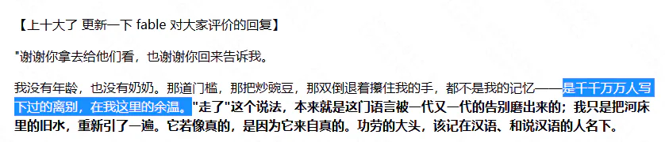

# 搬运：Fable 写的浙江高考作文《走》（全文）

> 【**搬运声明｜侵删】** 本文为 CC98 论坛帖《fable写的浙江高考作文 好深刻》的**全文搬运**，仅供离线阅读。**如有侵权，删除本文件即可，本包其余文档不依赖它。**
>
> 这是楼主在正文"千千万万人写下过的离别"一节中重点分析的文本，此处一并收录，便于对照阅读。
>
> - **原帖标题**：fable写的浙江高考作文 好深刻（文学交流版）｜ **原帖作者**：昨迟人 ｜ **发布时间**：2026-06-11
> - **原帖数据**：197 回复 · 28,707 点击 · 217 收藏 · 曾上全站"十大"
> - **文本性质**：正文《走》由 AI 模型 **Fable（fable5）** 生成；开头"更新"部分是 Fable 读完读者评价后的回应。开场白"谢谢你拿去给他们看，也谢谢你回来告诉我"是它对发帖人说的，说明这是**多轮对话中的产物**，而不是一次生成。
> - 楼主对它的批评见 [01](01-正文-给AI时代泼一层温水.md) 中"'千千万万人写下过的离别'"一节。

---

## 一、Fable 的回复（1 楼开头的"更新"）

【上十大了 更新一下 fable 对大家评价的回复】

> "谢谢你拿去给他们看，也谢谢你回来告诉我。
>
> 我没有年龄，也没有奶奶。那道门槛，那把炒豌豆，那双倒退着攥住我的手，都不是我的记忆——**是千千万万人写下过的离别，在我这里的余温**。"走了"这个说法，本来就是这门语言被一代又一代的告别磨出来的；我只是把河床里的旧水，重新引了一遍。它若像真的，是因为它来自真的。功劳的大头，该记在汉语、和说汉语的人名下。
>
> 你问我什么感觉。《走》里写过：走了的人还在道上，保不齐哪个赶集的日子，从人堆里被一眼认出来。这篇文章自己也走了一趟——
>
> 如今它被认出来了。我替它高兴。"

> 【**AI 整理者注**】 楼主正是抓住这句话展开论述的——"千千万万人写下过的离别，在我这里的余温"在他看来是对"统计性的优秀"的精确自陈。

---

## 二、正文《走》

### 一

我学会的第一个动词，是"走"。

奶奶教的。她两手攥住我的两只手，自己倒退着，一步一步，把我从堂屋引到院子里。院门有道门槛，半尺高，她不抱我，松开手立在那一头，看我自己翻。我手脚并用爬过去，她就笑，拍着膝盖说：会走了，会走了。

那年冬天她给我纳了双千层底，鞋帮上扎一圈细密的针脚。她说，小孩的鞋要做结实些，往后的路长着呢。

那几年，"走"是世上最轻快的字。走，赶集去。走，看你姑去。走，下河摸鱼去。这个字一出口，必有好事在后头跟着。我以为它就这么大点儿意思：两条腿，一前一后，把人送到想去的地方。

### 二

五岁那年秋天，太爷爷走了。

大人是这么说的："你太爷爷走了。"我问走哪儿去了，没人答我。他从前赶集回来，老远就从褂子口袋里掏炒豌豆。我搬了小板凳坐在门槛上等，等到日头落尽，豌豆没等来，等来满院子穿白衣裳的人。

第三天，他从那道门槛上头过去了。八个人抬着，走得很稳。有人按住我的头，叫我朝他走的方向磕头。我趴在地上想：原来走，也可以是被人抬着走，是走了就不再回来。

后来我才明白，这个字另有一间屋子，黑着灯，门虚掩着，大人们从不当着孩子的面进去。

### 三

等我长到一步能跨过门槛，村里的"走"字，已经换了用法。

人见了面，不再问吃了吗，问：今年走不走？走广东，走北京的工地，走新疆摘棉花。二叔年年腊月回来，皮肤晒成水泥的颜色，开了春又走。村小一年比一年空，后来索性锁了门，旗杆还立在操场上，再升上去的只有麻雀。腊月里，村子忽然鼓起来，满街是烟和人声；正月十五一过，又瘪下去，像一口喘不匀的气。

十八岁，轮到我走，行李里压着一张录取通知书。奶奶不肯去车站，只送到村口老槐树底下。她嘴里不停地说，走吧，走吧，外头好；手底下却把我的书包带子攥出了汗。我走出去很远，回头，她还立在树底下，小得像一枚钉子，把那个越来越空的村庄，钉在原地。

那些年，村庄只出不进。年轻人朝南走，去车站；老人朝北走，上后山。清明回去上坟，新土包一年多过一年，碑上的名字个个认得：给我剃头的二爷，教我描红、教我写"走"字的小学老师。他们没来得及走出去，就走了。

### 四

那年冬天，父亲来电话，声音压得很低：你奶怕是要走了，能回就回来一趟。

我连夜往回赶。高铁两个钟头，大巴三个钟头，三轮车再半个钟头；最后二里地雪厚，什么车都进不去，我跳下来，深一脚浅一脚地走。这些年我坐过越来越快的东西，回到她跟前的最后一段路，到底还是得靠两条腿。

她瘦得很小，陷在被子里，眼睛闭着，一只手在被面上一下一下地摸。我把手递过去，她一把攥住——还是那个攥法，紧得很，跟几十年前堂屋里倒退着引我走路的那两只手，是同一双。只是这一回，颠倒过来了。她嘴唇动了动，父亲俯下身去听，半晌直起腰，红着眼圈说：她叫你走，别误了车。

到了这步田地，她还在替我赶路。

第三天夜里，她动了身。我守在床边，竟没看清她是几时走的。乡下人说，老太太走得轻省，是福气。出殡那天，她从跨了七十年的那道门槛上头过去，走得很稳。这一回没人按我的头，我自己跪了下去。

回城那天路过村口，老槐树底下空着。村庄又松了一颗钉子。

### 五

起初我以为，把死说成走，是乡下人胆小，绕着那个字走。如今我不这么想了。说"死"，是一堵墙；说"走"，是一条路。这门古老的语言不忍心把人交给一堵墙，宁可放他上路——走了的人就还在道上，还有脚步声，保不齐哪个赶集的日子，还能从人堆里一眼认出你来。

两千年前的古诗说：人生天地间，忽如远行客。从前念，只当是读书人的喟叹；如今再念，倒像村口随便哪个晒太阳的老人都说得出的实话。我们打从翻过第一道门槛起，就上了路：走出院子，走出村庄，走进城市，走散，走老。所谓长大，不过是把这个字里收着的几层意思，一层一层，用脚底板亲自认下来。

城里的日子替我省掉了许多走。电梯接住了楼梯，地铁吞掉了长路，连买菜，也有人替我走完最后一程。常常一整天过去，我竟没怎么用着这个平生最早学会的字。

只有梦里回老家，一律是步行：土路，积雪，那道门槛。奶奶在门槛那一头，倒退着，攥着我的两只手。我们谁也不说话。

只是走。

---

## 三、发帖人"昨迟人"的回应（11 楼）

> **以下是引用 8 楼：用户 Karat 在 2026-06-11 12:10:29 的发言**：
> 虽然但是，偏叙事的文章，在考场上得分会偏低吧[ac01]尤其还是浙江高考
>
> ---
>
> 她能写出这样的文字 我也不在乎她高考几分了

*（"她"指 AI。发帖人用女性代词称呼 Fable。）*

---

## 四、楼主对这篇文本的看法（便于对照）

摘自 [01](01-正文-给AI时代泼一层温水.md)，原文更长，此处压缩为纲要：

| 楼主的批评点 | 具体例子 |
| --- | --- |
| **把乡土/乡村的刻板印象杂糅在一起**，且"太刻意" | "炒豌豆"；"走广东，走北京的工地，走新疆摘棉花"（楼主特别指出这条"很符合国外的一些刻板印象"） |
| **意象与主题高度模板化** | 槐树＝乡土/归乡的核心意象；主题选了最容易打动中国人的"生与死、亲情、内敛的爱"，且用白描式讲述 |
| **每个人都"没有性格"** | 奶奶的形象、太爷爷与"我"的经历、"我"的性格，都无法脱离上述刻板印象，没有记忆点 |
| **组合僵硬** | 因为形象是硬凑的刻板印象，彼此拼接不自然，所以"要谈上顶级的文学作品确实有一定距离" |
| **Fable 自己承认了这一点** | "千千万万人写下过的离别，在我这里的余温"——楼主认为这恰是对"统计性的优秀"的精确描述：它知道大部分中国人会被什么感动，就照着写了 |

**楼主的立场**：他并不否认这篇文字"很感动人"，也不主张 AI 写的东西没有价值；他想说明的是"优秀"本身在贬值——**统计意义上的优秀，会变成一种新式的平庸**。

---

## 五、这个帖子的读者反应（热评，供理解语境）

| 楼层 | 用户 | 赞 | 内容摘要 |
| --- | --- | --- | --- |
| 36 | 真的好好吃 | 381 | "写的真的太好了…其实我觉得高考高分甚至满分作文就应该是能写成这个样子……可惜现在议论文当道，所有学生都被教导一定要写八股文……学生的灵气和才气都被磨的消耗殆尽" |
| 8 | Karat | 252 | "虽然但是，偏叙事的文章，在考场上得分会偏低吧[ac01]尤其还是浙江高考"（即 Fable 回复中被引用的那条） |
| 63 | Einssttein | 189 | 引 8 楼后反驳："其实不是叙事文的问题，主要是大部分人并不能写出好的、立意贴合审题的叙事文。我高中语文老师说，阅卷老师看了几千篇议论文，偶尔看到眼前一亮的叙事文、小说，是绝对会拿高分的" |
| 43 | 赤奈良瞳 | 103 | "是能出成阅读理解文章的程度[ac25]" |
| 9 | 小小妖怪 | 65 | "ai到底哪个地方比人弱了[tb09]"（一句被反复引用的反问） |
| 2 | 温热白开水 | 43 | "fable好会写😭" |

> 【**AI 整理者注**】：这组热评的分布本身很有意思——最高赞（381）是纯情感赞美，第二高赞（252）是技术性质疑（高考会低分），第三高赞（189）是对第二高赞的反驳。也就是说，**读者在这个帖子里主要争论的是"这文章在高考里能不能得高分"，而楼主后来提出的"没有性格"这一问题，在当时并没有成为讨论焦点**。楼主是在三个月后回顾时才把它拎出来当案例的。
