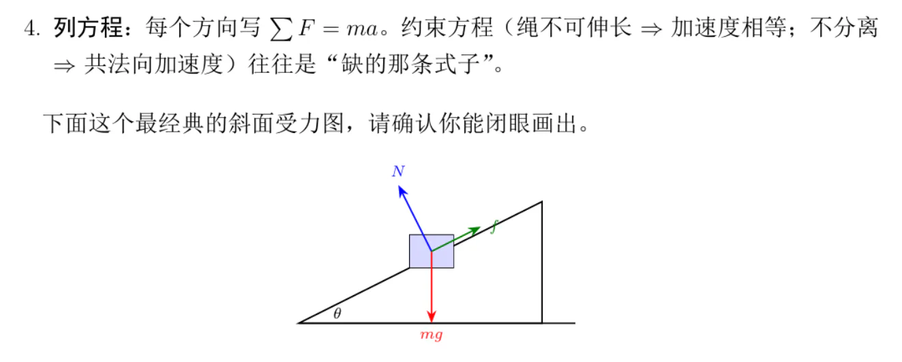
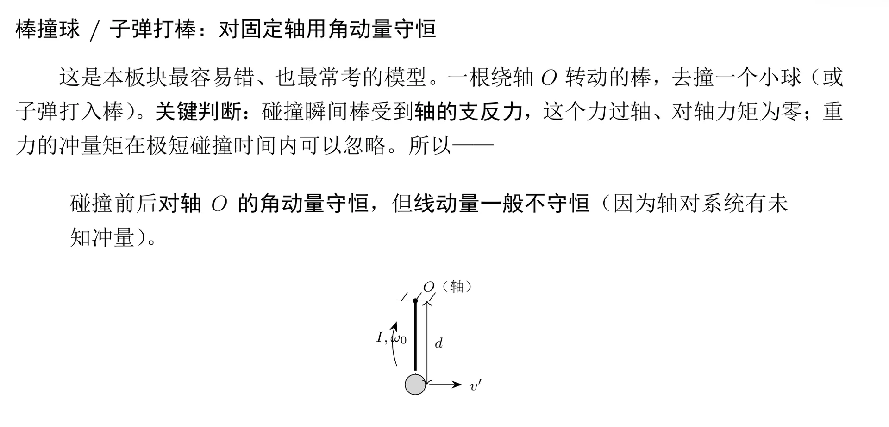
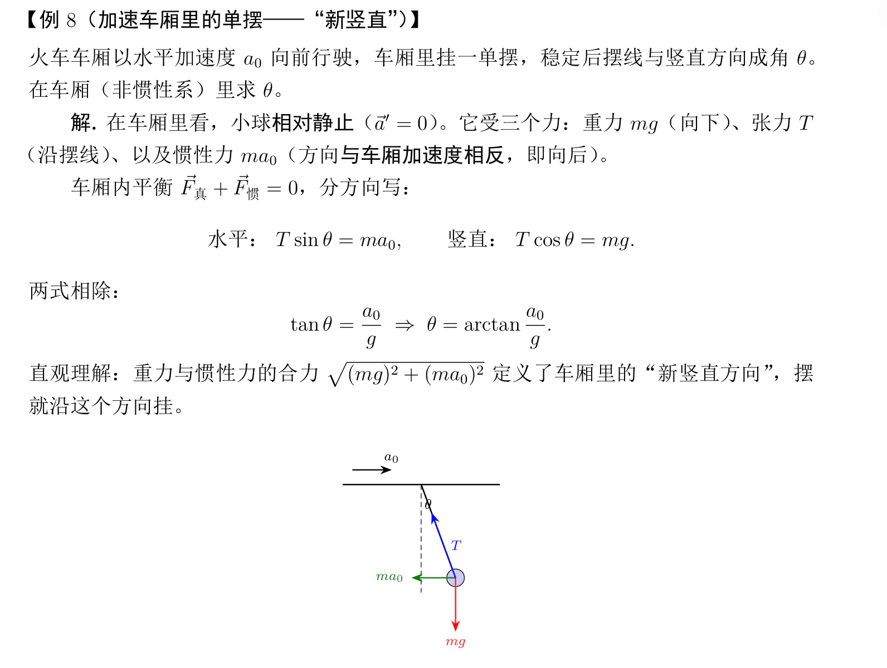
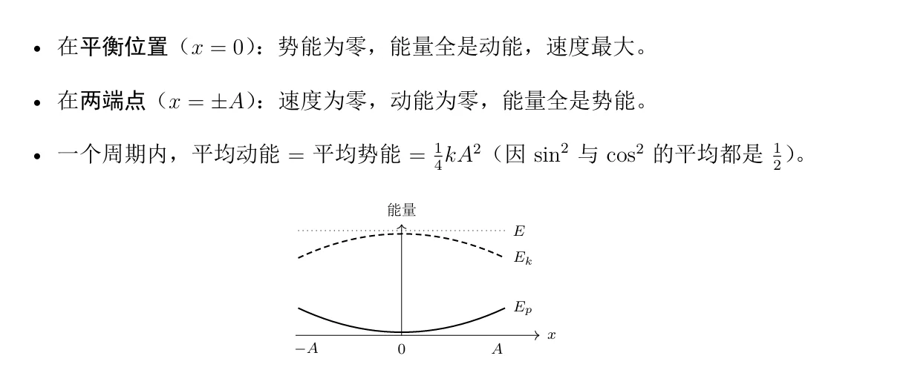
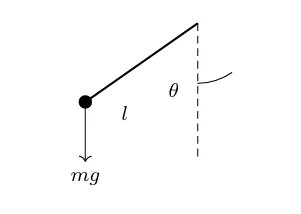
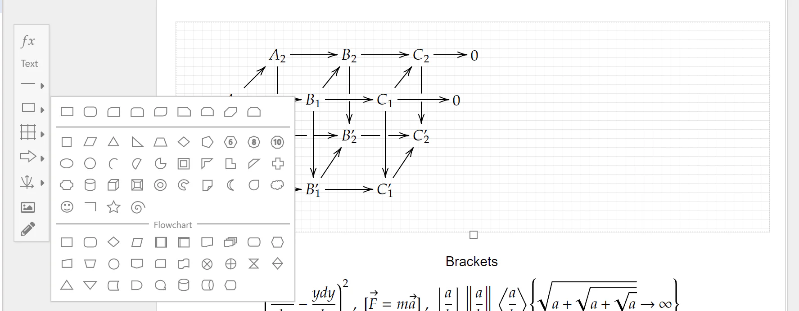
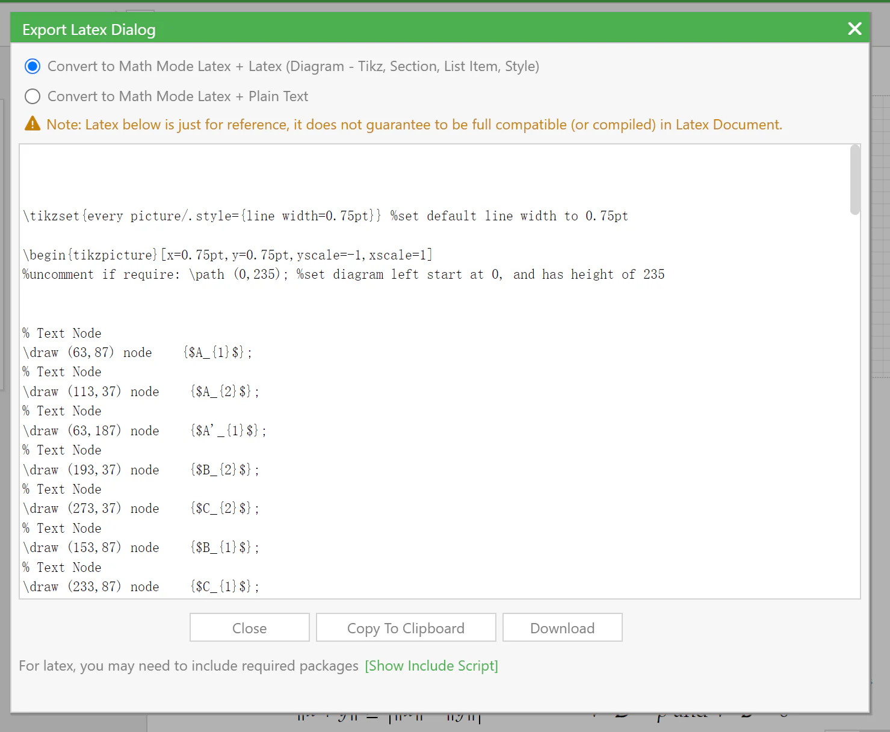

# 事件：2026 期末"大物／普物讲义"风波

> **为什么收这篇**：主文作者（正文楼主 XSYangtuo）在正文里点名"今年期末的一份大物/普物的学习资料"作为反面案例，但只用了几段话，普通读者看不出当时到底发生了什么。本篇把事件经过、双方原话、原始勘误截图都整理进来，并把那句容易被误读的"思路不太拟人"讲清楚。
>
> **整理者立场**：本篇全部内容为**技术层面的批评记录**，与主文作者原话"我对作者 ephemerall 没有任何意见哈！……对事不对人，大家也不要因此去攻击他"保持一致。本文件的目的不是评价某个人，而是保存一场关于"AI 生成学习资料"的公开讨论。
>
> **事件主体**（以下均指《大物（甲）与普通物理学期末真题知识点整理》那篇帖）
>
> | 项 | 内容 |
> | --- | --- |
> | 帖子 | 《大物（甲）与普通物理学期末真题知识点整理附真题与线性代数讲义更新》（学习天地版） |
> | 讲义帖楼主 | ephemerall ｜ 发帖 2026-06-20 11:21 ｜ 77 回复 · 14,156 点击 · 207 收藏 |
> | 触发 | 2026-06-20 22:30，本文主文作者在 43 楼回帖发出勘误，随后上热评 |
> | 结果 | 帖子风评反转；讲义帖楼主 ephemerall **未在 1 楼做勘误修改**（1 楼最后编辑时间为 06-20 11:28，早于勘误） |
> | 后续讨论 | 转向"AI 画 tikz 图为什么容易出错""98 的 bd 文化"等周边话题 |

---

## 一、事件经过（时间线）

| 时间（2026） | 事件 |
| --- | --- |
| 06-20 11:21 | 讲义帖楼主 ephemerall 发布帖子：四本物理讲义 PDF（基础讲义 / 正式讲义 / 真题 / 真题答案）+ 更新过的线代讲义，共 8 个 PDF 附件 |
| 06-20 11:28 | 该帖 1 楼最后一次编辑（此后未再更新） |
| 06-20 白天 | 帖子迅速获得大量"bd"和加风评，进入全站十大 |
| 06-20 22:30 | 主文作者（XSYangtuo）以层主身份在 43 楼发出勘误，列出 5 张图，指出配图错误，并质疑"大物和普物的考察重点是有挺大差别的，不知道笔记中如何体现" |
| 06-20 23:29 | 花祈（54 楼）表示"大概率不是渲染问题，就是 AI 出稿之后没有校对"，并展开讲 AI 画 tikz 图的问题 |
| 06-20 23:52 | George_C（59 楼）确认用的是 TikZ，并讨论箭头样式与图形化工具 |
| 06-21 前后 | 43 楼成为热评（180 赞），45 楼 George_C 的长评（114 赞）成为事件的"定性文本" |
| 06-21 | 该帖仍在十大榜上，同期另有一帖讨论"AI 生成攻略泛滥"，有用户评论"十大还挂着一个呢" |

---

## 二、触发点：43 楼的勘误（主文作者回帖原话）

> 同学，建议做一轮勘误吧。我想你可能是AI使用的成分比较多？我略微扫了一眼，只看你画图的部分，就有不少明显的错误。
>
> 这里是一些例子：
>
> 〔图1〕〔图2〕
>
> 这两个图尚且可以说是渲染出了问题？
>
> 〔图3〕
>
> 这个就是明显的问题了，后座力球往前面飘吗[em08\] 你都写了惯性非惯性的和平衡了图上一眼也不平衡呀
>
> 然后就是大物和普物的考察重点是有挺大差别的，不知道笔记中如何体现...
>
> 最好还是勘误一轮吧~
>
> --- 二编 ---
>
> 上热评了遂又扫了一眼，问题还不少...
>
> 〔图4〕〔图5〕
>
> 但是文本问题确实不是很多，因为我没找到硬性的问题，就是一些思路不太拟人？但是也有可能是不符合我的思考方式[em18\]

### 原始勘误截图

层主在 43 楼贴的图：

---

## 三、层主 George_C 的长评（45 楼，114 赞）——事件的"定性文本"

主文作者在正文里引用的"AI的行文风格'太吵'"就出自这里。全文较长，节选要点：

> 以后这种AI讲义能说明有多大比例的内容是AI生成的，以及AI辅助的程度有多大吗[ac06\]
>
> 感觉 让AI润色表述 和 直接让AI生成思路/逻辑链 还是很不一样的[tb01\]
>
> **AI讲义多了之后，以后纯手写的、有自己思考的讲义会不会被淹没呢**？
>
> ---
>
> **Edit：上热评就多说点吧。**
>
> 首先，分享、贡献精神毫无疑问是值得尊敬的……但是我觉得，这份讲义无论是在 *辅助应试* 还是 *辅助知识吸收* 都用处不大。
>
> **应试方面**，SAVIA 的讲义 已经是非常浓缩、简明扼要的优质资料，课件、历年卷的资料汇总也很丰富（比如《大学物理甲学习资料汇总整理》那个帖子）。大物的内容范围广，要做一份兼顾知识讲解和解题方法、面向不同物理基础的同学的优质讲义难度是比较大的。**内容多的课，大家都喜欢一眼看到重点。**显然 lz 这种讲义在行文上就让我不想读了，更何况一些配图的小错误、表述的 AI 味和拐弯抹角，让我不忍卒读。
>
> **学习知识方面**，虽然面向应试的资料不可避免地会极大削减学习本身的滋味，但是这种讲义完全没让我觉得在学物理，而像是进到了一个菜市场，在嘈杂的环境里听到了有个人在喊着几个物理名词。lz 可能是有意想还原老师讲解的口气，例题解答中确实有不少口语化的表述和提醒。但是如 @XSYangtuo 所说：
>
> > 但是文本问题确实不是很多，因为我没找到硬性的问题，就是一些思路不太拟人？
>
> 一方面 AI 的思考（不加以细致的调教和训练的话）并不是适合人去很舒服地理解的，另一方面还是 **AI 的行文风格"太吵"，频繁的加粗夺走了注意力**，物理又是需要坐冷板凳学的学科，于我来说格外地反感。
>
> 我想对 lz 说，做讲义是一件费心力的事，**读讲义也是**。在今天这个注意力涣散的年代，让人读几十面的东西是很难的，学习本身也如此。所以希望在产出学习资料的时候，问问自己做的内容有没有价值，对谁有用，是否对得起自己的努力。最起码，说清楚自己的付出，和 AI 的使用情况说明。**如果只是为了赞、好评、风评、粉丝、年度用户，那我觉得分享也成了一种虚荣。**这种公共课的资料已经过饱和，低质的资料不如沉默更有利于生态。
>
> 我想对前排 bd 的同学说，你们 bd 一个内容之前，有看过内容本身吗？只是篇幅长，就值得你们的拥护与称赞……还是说看到"经常发讲义的那个 lz 又有新作了"就下意识 bd？那我觉得这和饭圈也没什么本质区别，学习天地饭圈罢了。

---

## 四、"思路不太拟人"到底指什么（主文中的深化）

这是整件事里最需要注释的一句话，因为字面上像是在骂人，实际是本文的核心论点。主文作者后来在同一帖里补充说：

> 单看任何一部分，都是最优路径，都在用最好的办法讲解。但是只要稍微连起来你会发现**思维链比较断裂**，而且充斥着**对过去题目的过拟合**。……但是物理学是非常系统的学科，不同人的思考模式可能不同，但是一定是一个系统，这个笔记则没有这个系统，即使用于复习应试我认为也不够格。（比如习惯用能量和动量描述系统的人，和习惯用位移速度描述系统的人，各自都是一整套语言）

也就是说，"不拟人"不是指"读起来不像人写的"，而是指：

1. **局部最优、全局断裂**——每个段落单看都很好，连起来没有一条自己的主线；
2. **没有内在一致性**——物理学里，一个作者会选择一套描述语言（能量-动量，或位移-速度）贯彻到底，这份讲义在不同片段间来回切换；
3. **过拟合真题**——喂给 AI 的近期题目会主导它的表述，导致"看起来什么题都能讲，其实没有体系"。

主文作者的结论是：

> 每个笔记都有适合的人，比如有人喜欢教材A而不喜欢教材B……但这个笔记试图让所有人都能合适，最终却都不合适。因为人编写的教材是有性格的，人也是有性格的，需要相匹配才行，**而AI却倾向于生成没有性格的内容**。……很多科研人会称之为 Taste——这就是 AI 目前没有的东西。

---

## 五、周边讨论（为"为什么 AI 画图容易出错"提供了技术解释）

### 花祈（54 楼）：不是渲染问题，是没校对

> **大概率不是渲染问题，就是AI出稿之后没有校对**。
>
> AI画tikz图现在就是超级大硬伤，这种重叠/错位尤其经典，我之前用AI画tikz图也是调教几遍真出不来就放弃了，后面写教程笔记啥的tikz图也是手工用mathcha画的。
>
> 当然现在也有tikz-mcp这种，但是强依赖视觉能力，感觉耗token会很疯狂而且效果不一定好所以没试过。
>
> ……顺便说个暴论，我觉得多数情况下裸写tikz代码和用hex手写elf文件是一个性质，tikz就应当是用一些图形化工具编辑完然后生成tikz代码再贴到latex文件中才对。

**术语注释**：tikz 是 LaTeX 中的矢量绘图宏包，图画得好不好取决于**代码**而非手工拖动，因此很难"看一眼就知道对不对"；AI 生成 tikz 代码时，只要代码语法过关就能编译成图，**图里的箭头指错方向、力漏画一支，编译器不会报错**。这解释了为什么"配图错误"会成为这类 AI 讲义最集中的故障点。

### George_C（59 楼）与花祈（60 楼）：工具链讨论

> **George_C**：肯定用的是 Tikz，这个箭头一看就是默认的 -latex 样式，我一般嫌丑都会用 -Stealth。
>
> **花祈**：我个人会用 mathcha（www.mathcha.io）……点 Menu→Export Section To LaTeX 可以导出 tikz picture。但是就算这样还是很麻烦啊\[del\]而用AI写讲义的人最怕的就是麻烦了\[/del\]

### 其余有代表性的回复

| 楼层 | 用户 | 赞 | 内容 |
| --- | --- | --- | --- |
| 44 | 不问西东 | 65 | "就个人复习经验而言，SAVIA的笔记配合历年题已经有很好的效果了（因为是纯手搓的，可学度很高）" |
| 48 | 喜多郁代 | 65 | "之前也被指出来ai含量超高了吧，还没改吗[ac50\] 我觉得小心现在吃的风评以后被扣回来。" |
| 49 | 易木Ewood | 120 | "唉学弟，还是希望你对自己的资料和读者负责，包括平常有些事情也希望你能脚踏实地做……不要被风评粉丝点赞给蒙蔽了[ac07\] 我看你的讲义里有的式子都长到超出页面范围了，这谁绷得住[ac01\]" |
| 52 | Hydrofoil | 57 | "98看到大部头资源帖就疯狂bd加风评属实难绷……我更希望能有一些基于内容的反馈，因为这样不仅是我发帖提供了可能的帮助，我也能从大家的回应中学到东西" |
| 56 | 易木Ewood | — | "这个图片太典了，就是ai画tikz图的经典问题[ac01\]……感觉都是ai搞的然后自己也没审过" |
| 62 | Trifct | — | "只能说本帖和考拉的帖子都在十大上有点讽刺[ac01\]" |
| 77 | yhwis | — | 补充优质替代资料：线代有 LALU（"算是完整的教材，可能更适合平常学的时候就看"）、普物有竺院学长编写的 GPA 讲义 |

**对照组的资料（当事讨论中公认优质的人工资料**）：

| 资料 | 说明 |
| --- | --- |
| **SAVIA 的物理讲义** | 被反复作为"浓缩、简明、可学度高"的标杆 |
| **GPA 讲义** | 竺可桢学院学长编写，普物方向 |
| **LALU** | 线代方向的完整教材式讲义 |
| 《**大学物理甲学习资料汇总整理**》 | 课件与历年卷的资料汇总帖 |
| 《**普物回忆卷**》 | 由 George_C 手打整理 |

---

## 六、几点补充

1. **本事件的公开讨论集中在技术层面**：参与者批评的是"配图错误 + 未校对 + 未说明 AI 参与程度 + bd 文化"，而不是针对作者本人。主文作者、层主 George_C、层主 易木Ewood 的措辞都明确区分了"分享精神值得尊敬"与"这份资料的质量"。
2. **关于"作者是否回应"**：截至 2026-09-18 抓取时，讲义帖 1 楼未做勘误更新（最后编辑时间 2026-06-20 11:28），讨论的重心也转向了工具与社区文化。因此本文件不对讲义帖作者的态度作任何推断。
3. **关于那几张图**：本文件只贴图，不对图本身作技术判断。哪些地方错、错在哪，以 43 楼原话和原帖后续讨论为准（第二节已完整引用）。
4. **主文的用法**：主文把这件事当作"平均的优秀会失效"的反例——在需要体系性的学科里，把每一块都写成最优解，反而拼不出一个能用的整体。理解这一点，才能理解为什么这篇文章既批评 AI 讲义，又同时为 AI 的能力辩护。
