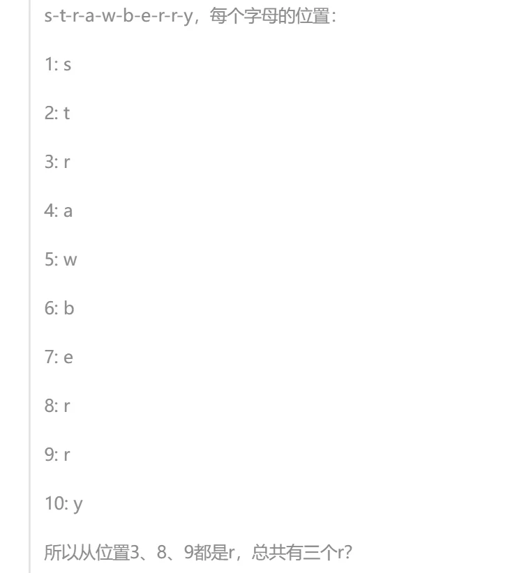
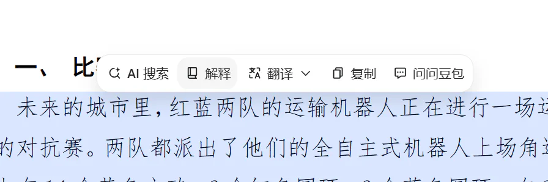
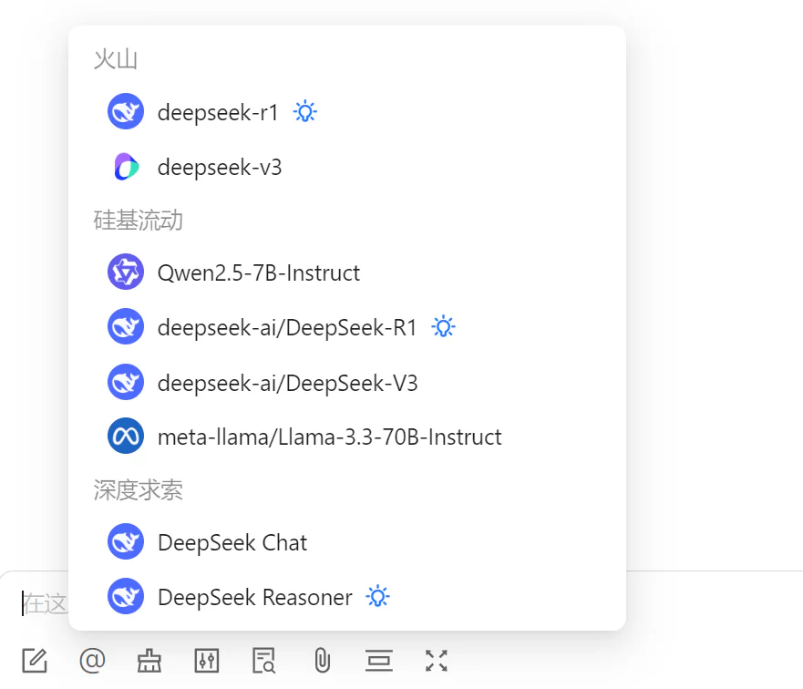
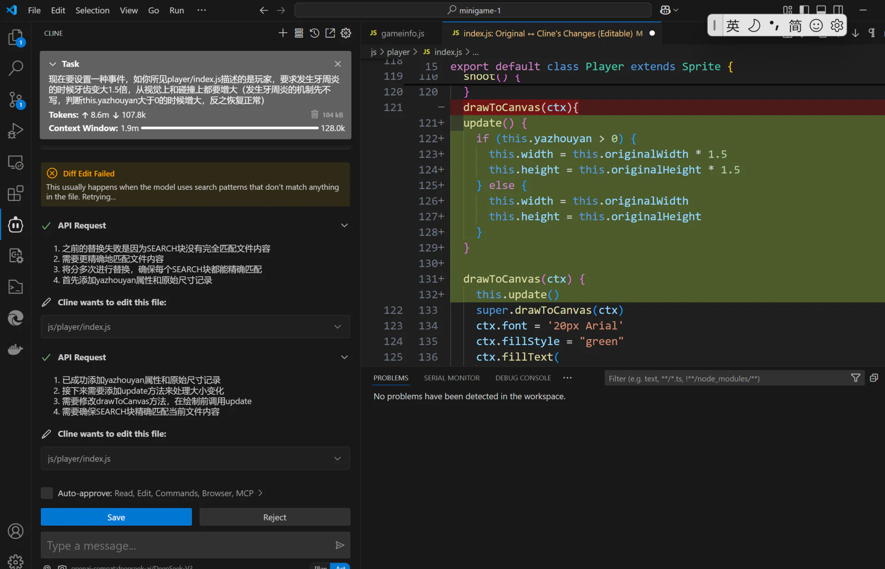
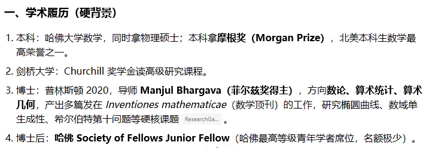

# 相关帖子摘要（被主文引用的"内部文章"）

> 主文提到了四篇帖外内容。其中 Fable 作文帖已全文搬运（见 [02](02-搬运-Fable《走》全文.md)），大物讲义帖已单独立篇（见 [03](03-事件-大物普物讲义风波.md)）。本篇收录其余两篇的摘要，以及被顺带提到的两个链接，供离线阅读时补全上下文。

---

## 一、主文作者自己的旧文：《作为普通人，在大语言模型日常使用中的一些思考感想整理分享：越聪明，就是越好用吗？》

| 项 | 内容 |
| --- | --- |
| 原帖 | 《作为普通人，在大语言模型日常使用中的一些思考感想整理分享》（编程技术版） |
| 作者 | XSYangtuo（即主文作者） |
| 发布 | 2025-03-22 03:38 |
| 数据 | 17 回复 · 2,966 点击 · 178 收藏 |

**主文对它的态度**：开头自嘲为"屎作"，说"现在已经充斥着过时的观点了"，并向读过的人"郑重道歉"。但紧接着又说"很庆幸当时为自己留下了一些记录，为那个AI青涩的时代留下了一些印记"——**这篇旧文是主文的直接对照物**，主文里"我的沦陷"一节就是从这篇的时间点开始讲的。

**核心问题意识**：*聪明是判定一个大模型好用的唯一最重要因素吗？*

**主要论点**：

1. "**更聪明"不等于"更好用**。当时各大模型已经跨过了"最基本的聪明线"，除非让 AI 直接做数学题，日常生活里"大家都足够聪明了"。作者举的例子是：同学宁可直接问他一个简单语法问题，也不愿问 DeepSeek，因为"总觉得它很慢"。
2. **批评两种极端用法**：
   - 只把 AI 当**文本生成器**（写读后感、做简单整理、翻译），没发挥潜力；
   - 把 AI 当**全知全能的神**（发一整道大题让它做、问偏门知识且不加考证地采纳）。
3. "**大语言模型首先是语言模型**。作者的思维实验是："假想自己是个只有文字能力的生物，没有一切五感和逻辑，只有前后文，那自己是否能处理这些问题呢？"他用经典问题"strawberry 有几个 r"来解释：对只有文字能力的生物来说，straw 和 berry 是不可拆的两个单元（即 token），所以"数不出来"是结构性的，不是"笨"。他贴出了 R1 的思考过程截图，说明模型是通过在前后文里"真的数一遍"才得到答案的——**它没有一个"心"来做默数**。

4. **给出"更实用的生产力用法"清单**：把 AI 当高级搜索引擎问稍难的理论问题；当扫描排版机（把手写潦草的公式排版成 markdown+LaTeX，把图片表格转成可粘贴到 Excel 的表格，但特别注明"别用 kimi 和 deepseek，识别水平不好"）；代码补全；对照翻译读论文。
5. **选用大模型应考虑的因素排序**：稳定性 > 泛化能力（智力）> 输出速度 > 多模态能力 > 记忆力 > 经济效益。
6. "**第一个关卡：自己部署还是用网上资源？**——明确不推荐日常自部署（硬件成本、技术要求、速度慢），除非需要信息隐私 / 离线。
7. "**第二个关卡：国内还是国外？**——当时他认为国外 AI 性能更强，但"稳定性太差了"（梯子、封号、网络波动），并提到校内的 zchat 镜像站，结论是"目前来看，我已经完全放弃了国外AI"。
8. **当时对各模型的评价**（**注意：这是 2025 年 3 月的快照，早已过时**）：kimi 长文本和记忆力强、有一点小文采、速度挺快，但多模态拉跨；chatglm 综合能力不错没有明显短板；deepseek 数理推理顶级、"文本撰写思辨能力也是顶中顶"，但输出速度偏慢、多模态基本为 0；最后首推字节跳动的豆包——"虽然豆包不够聪明，但是智商算是合格……**但是豆包的配套设施做的真好，UI 用起来特别舒服**"，多模态识别率很顶。
9. **第三部分"周边产品"**（可视为 2025 年初的一份"普通人 AI 工具链"清单）：
   - **聚合客户端**：推荐 Cherry Studio（也提到 chatbox 设置切换麻烦），一个窗口里 @ 不同家的 DeepSeek；
   - **API**：解释"API 相当于一把钥匙"，需要的三个参数是地址、密钥、模型 ID；提到硅基流动与火山引擎（"申请 API 很麻烦，但用起来嘎嘎香，速度最快"）；
   - **编程插件**：补全类（Copilot / FittenCode / CodeGeeX）与 **Cline**（"会自动帮你增删改查你的代码，甚至直接做一整个项目，缺点是 Token 消耗有点猛"）——**这正是主文"我的沦陷"一节里那张 Cline 截图的出处**。
10. **结语**："希望我们使用大模型不是流于表面的狂欢……纵使很多人有着未来AI统治人类的畅想，但目前我想做的就是，**榨干AI的每一分生产力！**"

**为什么值得看**：把它和主文对照，能看出一年的时间里作者的问题意识发生了怎样的迁移——旧文是**工具论**（哪个模型好用、怎么用、买哪家 API），主文已经变成**价值论**（人的价值在哪）。旧文结语的"榨干 AI 的每一分生产力"和主文结语的"退到最后，剩下的那一步，恰好是人自己"，是完全两种情绪。主文里"AI 把属于人的部分还给人"这个结论，正是从"工具论"里走出来的。

**旧文的其余配图**（按原文出现顺序）：

---

## 二、菲奖帖：《AI已经做出菲奖级成果》

| 项 | 内容 |
| --- | --- |
| 原帖 | 《AI已经做出菲奖级成果》（科研学术版） |
| 作者 | Sim_DBM ｜ 发布：2026-08-28 19:51 |
| 数据 | 10 回复 · 1,286 点击 · 0 收藏 |

**1 楼全文**（全文就这么长）：

> 【人结合AI的菲奖级成果，正式通过形式化检验！—哔哩哔哩】
>
> 已瘫坐眩晕。
>
> 我已经想象不到哪怕五年后的世界了

**主文对它的引用**（"一个数学领域的例子"一节）：主文作者查证后指出，视频主角本人是一位享有声誉的数学家，且就在 A\ 工作，做的正是这方面研究——所以这更像"人结合 AI"而非"AI 独立完成"。楼主的关键追问是：

> 如果不是一位数学家，可以完成这样的壮举吗？就算你说他只是鼓励而已，那他的鼓励是不是有特殊的价值呢？一个数学家的鼓励和一个普通人的鼓励能一样吗？

并顺带指出了标题落差：**B 站视频标题尚且克制地叫《人结合AI的菲奖级成果》，98 的帖子标题却写成《AI做出菲奖级成果**》。他还贴出了自己搜到的该数学家履历：

【**AI 整理者注**】：帖内 10 条回复中，有的提出反例（如 28 楼 climb 提到 Y-T-D 猜想反例可由 Danus agent 独立完成），楼主在 31 楼做了回应（见 [04](04-热评精选.md)）。讨论没有形成定论，但楼主的核心论点——"**人的辅助本身就有价值**——在这一轮里没有被驳倒，只是被补充了"AI 的独立性也在增长"。

---

## 三、顺带被提到的两个链接

### 1. 《【学习天地】大学物理甲学习资料汇总整理》

《大学物理甲学习资料汇总整理》。在讲义风波中被 George_C 作为"资料汇总很丰富"的例子引用（见 [03](03-事件-大物普物讲义风波.md)）。

### 2. 主文作者自己排版的回忆卷

《2024-2025 cc/llk或lx/渡边 普通物理学/普物II回忆卷精装修订版》。这是**旧文中"把 AI 当扫描排版机"的自证案例**——作者把自己手写潦草的公式图片用 AI 排版成 markdown+LaTeX 后发布。George_C 也在讲义帖里提到自己写过《普物回忆卷》并且是"手打的"。

> 这两个链接的对照关系值得注意：**同一个版面、同一门课，一个人在 2025 年用 AI 排版手写回忆卷（并且自豪地当作"生产力用法"举例），一年后在 2026 年却成为最严厉的 AI 讲义批评者**。这不是立场反复，而是他自己在正文里描述的那条线——"一开始只是补全，后来放手让 AI 做 UI，再后来连架构都交给 AI"，他是在亲身走过这条路之后，才对"哪些环节可以交给 AI、哪些不能"有了具体的判断。

---

## 四、其它上下文链接（主文中出现但未展开的）

| 链接 | 说明 |
| --- | --- |
| 《点击查看真的很困的小困羊驼》 | 情感版"一路走来"的日记楼（俗称"一路楼"），主文后记中说"当时在一路写的草稿"即指此类日记楼。该楼 1,359 回复 / 28,295 点击 |
| 98 的其他客户端 | 主文提到 vibe coding 之后出现了"windows原生、苹果、鸿蒙、小红书风格的客户端，甚至 AI Native 的 98 cli"，均为站友自行开发 |
| 98 官方小程序 | 主文作者参与其重构，这是他"逐步放权给 AI"自述的第一手经历来源 |
